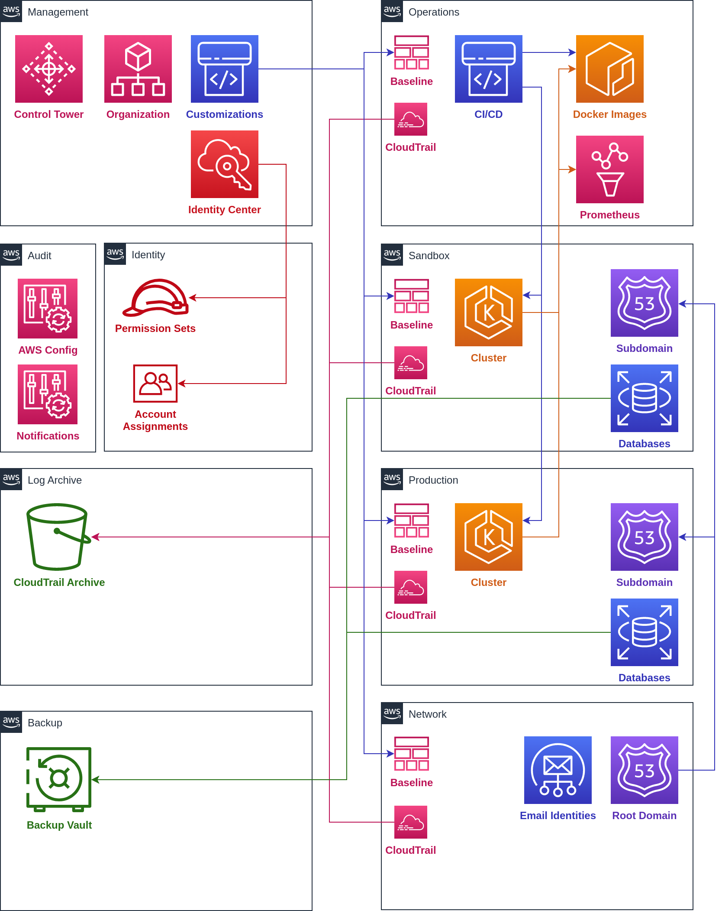

# Standard AWS Accounts

Account |   | Access | Diagram Notes
-- | -- | -- | --
Management |   | Control Tower Organization Customizations Identity Center | Customizations flow to operations, sandbox, production, and network
Identity | This account is the delegated administrator for the Identity Center instance and manages permission sets and account assignments. | Identity Center | Identity Center in the Management account delegates to permission sets and account assignments in the Identity account.
Operations | This account contains CI/CD pipelines for building and deploying applications, as well as any centralized application monitoring tools like Grafana and ElasticSearch. IAM roles for entry point access are also deployed to this account. The goal for this account is to allow developers to perform most of their tasks, such as deploying and debugging applications, without logging into any account besides the Operations account. | CloudTrail CI/CD Docker Images  Prometheus | Baseline flows to sandbox, production, and network.CI/CD flows to docker images and clusters in production and sandbox. Cloudtrail flows to sandbox, production, network, and log archive.
Network | This account contains centralized DNS and networking resources including: Route 53 hosted zones for root domains SES domain identities If using a hub-and-spoke network architecture, the hub resources | Baseline CloudTrail Email Identities Subdomain Root Domain | Root domain connects to subdomains in production and sandbox.
Audit |   | AWS Config Notifications |  
Log Archive |   | CloudTrail Archive |  
Production | This workload account contains resources for running production workloads, including: An EKS cluster running the Flightdeck platform Any databases required for running applications on the platform S3 buckets and other cloud resources for running applications This account will also contain a Route 53 hosted domain for its workloads. Nameservers for the subdomain can be delegated from the Network account, and aliases can be added in the root hosted zone for public addresses. | Baseline Cluster Subdomain CloudTrail |  
Sandbox | This account mirrors the production account, but runs development and staging workloads. This account will typically contain resources that are identical in shape to production but smaller in size. | Baseline ClusterSubdomainCloudTrail |  
Backup | Contains isolated backup vaults of workload data. Access to this account is strictly locked down to prevent deletion of backups in the event of a Ransomware attack. | Control TowerCustomizations | Sandbox and production accounts connect to the vaults in the Backup account.
